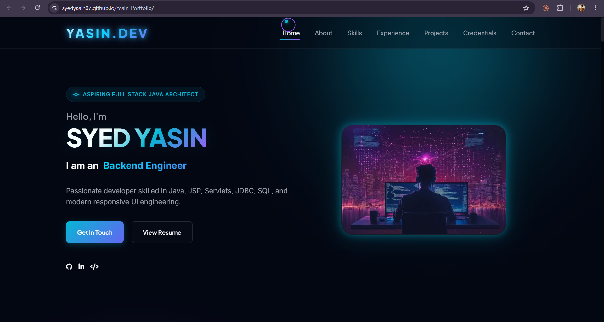

🚀 Syed Yasin Portfolio Website

  

  <strong>Premium Full Stack Java Developer Portfolio</strong> 
  Showcasing skills, projects, internships, certifications, and professional journey.

  

---

🌐 Live Website

🔗 Portfolio Link:
https://syedyasin07.github.io/Yasin_Portfolio/

---

📌 About The Project

This portfolio website was designed and developed to showcase my professional profile as an aspiring Full Stack Java Developer.

The website highlights:

- Professional Introduction
- Technical Skills
- Academic Background
- Internship Experience
- Featured Projects
- Certifications
- Contact Information

The portfolio follows a modern dark-themed UI with smooth animations, responsive layouts, interactive components, and a professional user experience.

---

✨ Key Features

🎨 Modern UI/UX

- Dark premium theme
- Glassmorphism effects
- Neon glow animations
- Smooth transitions

📱 Fully Responsive

- Mobile Friendly
- Tablet Friendly
- Desktop Optimized

⚡ Interactive Components

- Animated Hero Section
- Dynamic Statistics Counter
- Project Preview Modals
- Animated Skill Progress Bars
- Scroll Progress Indicator
- Custom Cursor Effects

💼 Professional Sections

- About Me
- Skills
- Experience Timeline
- Projects Showcase
- Certifications
- Contact Form

📧 Contact Integration

- EmailJS Support
- Direct Email Contact
- Phone Contact
- Social Media Links

---

🛠️ Tech Stack

Frontend

- HTML5
- CSS3
- JavaScript (ES6)

Design

- Responsive Design
- Flexbox
- CSS Grid
- Glassmorphism UI
- Custom Animations

Libraries & APIs

- Font Awesome Icons
- Google Fonts
- EmailJS

---

# 📸 Portfolio Preview

## 🏠 Home Section

🔗 Live Preview:
https://syedyasin07.github.io/Yasin_Portfolio/

---

## 👨‍💻 About Section

🔗 Direct Section:
https://syedyasin07.github.io/Yasin_Portfolio/#about

---

## 🧠 Skills Section

🔗 Direct Section:
https://syedyasin07.github.io/Yasin_Portfolio/#skills

---

## 💼 Experience Section

🔗 Direct Section:
https://syedyasin07.github.io/Yasin_Portfolio/#experience

---

## 🚀 Projects Section

🔗 Direct Section:
https://syedyasin07.github.io/Yasin_Portfolio/#projects

---

## 🏆 Achievements & Certifications

🔗 Direct Section:
https://syedyasin07.github.io/Yasin_Portfolio/#certifications

---

## 📬 Contact Section

🔗 Direct Section:
https://syedyasin07.github.io/Yasin_Portfolio/#contact
💼 Featured Projects

🛒 Flipkart Clone

Full Stack E-Commerce Application built using:

- Java
- JSP
- Servlets
- JDBC
- MySQL
- MVC Architecture

Features

- User Authentication
- Shopping Cart
- Product Management
- Session Tracking
- Database Integration

---

🎓 Student Management System

A complete CRUD-based student management platform.

Features

- Student Registration
- Login System
- Database Operations
- Secure SQL Queries
- JDBC Connectivity

---

🎬 Netflix OTT Platform

Frontend OTT Streaming UI inspired by Netflix.

Features

- Responsive Layout
- Interactive UI
- Movie Sections
- Modern Design Patterns

---

🎓 Education

B.Tech Computer Science Engineering

Sri Venkateswara College of Engineering, Tirupati

CGPA: 8.95

---

Intermediate (MPC)

TMR Junior College

Percentage: 95%

---

💼 Internship Experience

Java Full Stack Development Intern

Phani Soft Tech Solutions (PST)

- Java
- JSP
- Servlets
- JDBC
- SQL
- MVC Architecture

---

Artificial Intelligence Intern

Achieve Academy

- AI Concepts
- Data Analysis
- Automation Workflows
- Intelligent Systems

---

🏅 Certifications

- Java Full Stack Development – PST
- AWS Technical Training
- Java 8 Lambda Workshop
- Artificial Intelligence Internship

---

📂 Project Structure

Yasin_Portfolio/
│
├── index.html
├── style.css
├── script.js
│
├── Home.png
├── About.png
├── skills.png
├── experience.png
├── projects.png
├── Achievements.png
├── contact.png
│
└── assets/

🚀 Run Locally

git clone https://github.com/SyedYasin07/Yasin_Portfolio.git

cd Yasin_Portfolio

Open index.html in browser

📞 Connect With Me

👨‍💻 Syed Yasin

📧 Email: syedyasin075@gmail.com

📱 Phone: +91 6303834758

💼 LinkedIn:
https://www.linkedin.com/in/syed-yasin-296a49348/

💻 GitHub:
https://github.com/SyedYasin07

🌐 Portfolio:
https://syedyasin07.github.io/Yasin_Portfolio/

---

⭐ Support

If you like this project, please give it a ⭐ on GitHub and share your feedback.

---

Made with ❤️ by <strong>Syed Yasin</strong>

